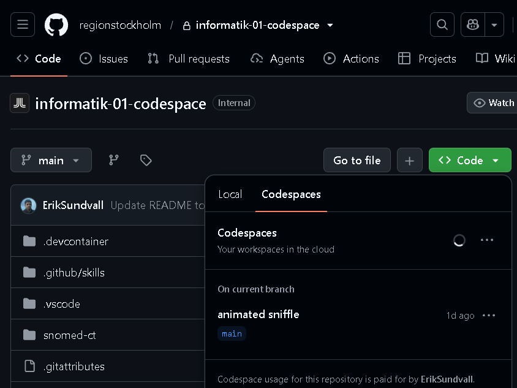
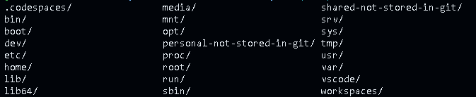
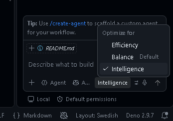
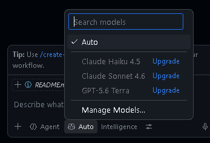

# informatik-02-codespace
Basic workspace/codespace setup, variant #02, for medical/clinical informaticians to use for running e.g. terminology server and openEHR-assistant tools

## Create your own Codespace

If this repository (see e.g. the URL in your browser) is called ...regionstockholm/informatik-02-codespace-template then it acts as a template repository that is maintained by the workspace maintainers, from Karolinska's Platform team. 

To get started, create a new separate repository based on this template (as described below) rather than trying to work directly in this regionstockholm/informatik-02-codespace-template repository. 

Then rewrite this README.md file to better reflect the name and purpose of your copy. If you are collaborating with others, then it can be smart to let others work in (or in turn copy) your copy so that you can merge your work.

### Create your own repository (first time, unless invited to somebody else's)

1. Sign in to GitHub and open this repository (if not already done).

2. Select **Use this template** and then **Create a new repository**.

   
3. Choose an owner (either your private GitHub account for experiments — or your employer's, e.g. regionstockholm for shared work) and choose a repository name. 


### Create a codespace (or open an existing one if available)

The general documentation about Codespaces is found at https://docs.github.com/en/codespaces

If you are new to Visual Studio Code (VS Code) you may want to learn about it first, e.g. at https://code.visualstudio.com/learn You need to know at least how to open the "terminal" (it is a menu bar choice and usually appears at the bottom of the screen). A codespace is running on a computer in the cloud and shows up as a running VS Code in your web browser window (or as an application if you choose to "install" it on your desktop from the install button in the URL bar of your browser).

If you (or somebody else who has invited you to collaborate) have already created a codespace then you will see it in a list like "animated sniffle" in the screenshot below (they get auto-assigned rather creative names...) and you can just reopen it rather than creating a new one. It is also possible for two persons to work in the same codespace (if invited) a bit like writing simultaneously in Google Docs.



#### First time creation and initial tests

In the new repository, first time if no codespace exists, select **Code > Codespaces > Create codespace on main**.

(insert image here)

GitHub then builds the development container from the configuration file `.devcontainer/devcontainer.json`. The first build can take several minutes.

When it is ready, VS Code will open in the web browser — inside it open a "terminal" and check that at least these tools are available after the first install, by typing each line followed by Enter:

```bash
sct --help
python3 --version
```

A version number should be returned. The `sct` command checks if the SNOMED CT tool SCT, made by Marcus Baw, is installed and working. The second command checks that the programming language Python is installed (it is used for some loading scripts and is one of the languages you (and your AI) can use here).

### First-time SNOMED CT setup

The codespace container installs the SCT command automatically, but it does not automatically download SNOMED CT releases or build a database. You have to get hold of suitable SNOMED CT distribution ZIP files that are licensed to your organisation from your national release centre. Example: If you are a logged-in employee of Region Stockholm (which holds a licence) just download the required RF2 ZIP files from the internal [Snomed-release-filer](https://sllse.sharepoint.com/:f:/s/KTeamsKITScrumTeams/IgCcDD7gSG9eRZrB6qmU0RO5Afr1xyJX7rxVpe4SxcFTdxw?e=ABU7RG) Teams file area that is only available to employees. In the VS Code Explorer, drag the downloaded ZIP files into the repository's `import-landing-zone` folder, and check that they have all landed there (it can take some time), then run these three commands in the VS Code terminal:

```bash
python3 .devcontainer/import-snomed-releases.py
python3 .devcontainer/load-snomed-release.py
python3 .devcontainer/build-latest-snomed-database.py
```

The import script identifies each release from its RF2 contents, moves it into the dated `snomed-ct/` folder, and removes it from `import-landing-zone`. It records the time and destination in `import-landing-zone/landing-zone-log.md`; after a successful import, that log is the only file left in the landing zone. The ZIP archives in `snomed-ct/` are ignored by Git and stay local to the Codespace.

The script selects the newest Swedish folder, reads its International dependency from RF2 metadata, and requires that exact International release before layering the two archives. It stores `swedish-snomed.ndjson` and `swedish-snomed.db` under `$SCT_DATA_HOME/data`, applying the Swedish preferred terms from the Swedish language refset. It also builds SCT's transitive-closure table and indexes to speed up hierarchy queries. Example: The 2026-05-31 Swedish release requires International 2026-02-01; the later released bundled 2026-10-01 International release is not a substitute. To add or repair the closure table in an existing database, run `sct tct --db "$SCT_DATA_HOME/data/swedish-snomed.db"`. To start the server separately after a compatible build, run `cd "$SCT_DATA_HOME/data" && sct serve --db swedish-snomed.db`.

See [DEVCONTAINER-MAINTAINER-README.md](DEVCONTAINER-MAINTAINER-README.md) for release intake and compatibility requirements.

### Running SCT (SNOMED CT) server or external terminology servers

After the first-time SNOMED CT index build completes, start the local terminology server when you need it by typing this in the terminal:

```bash
cd "$SCT_DATA_HOME/data" && sct serve --db swedish-snomed.db
```

The forwarded server is then available from the Codespace's **Ports** view. See [SCT terminology tooling](#sct-terminology-tooling) for selecting a release or troubleshooting compatible International and Swedish distributions.

You can also from your own scripts call HL7 Nordic Ontoserver at https://tx-nordics.fhir.org/fhir/r4/, a FHIR R4 terminology server with SNOMED CT and other terminologies installed, if you do not want to run a local terminology server in your codespace. The Ontoserver provides SNOMED CT as well as some other installed terminologies through its FHIR R4 endpoint.

## Available programming language runtimes
- Deno (for JavaScript/TypeScript)
- Python (version 3)
- Rust
- Java/JVM

## Installed servers, MCPs etc.
- openehr-assistant from https://cadasto.github.io/openehr-assistant/
- local SCT SNOMED CT tools that include an MCP server for your AI agents

This repository includes two homegrown experimental (fairly untested) rudimentary reusable AI skills for the local `sct` MCP tools:

- [SNOMED CT term mapping](.github/skills/snomed-term-mapping/SKILL.md) maps proprietary term lists to existing concepts and flags uncertain results or `NO_MAP` items for review.
- [SNOMED CT concept modelling](.github/skills/snomed-concept-modelling/SKILL.md) turns unresolved items into a validated post-coordinated expression and a separate draft proposal for the responsible authoring or National Release Center process.

These skills support terminology work; they do not approve mappings, mint new SCTIDs, or replace clinical and terminology-authoring review.

### Using the openEHR assistant
For an openEHR task like translating, you can explicitly ask the assistant to use the MCP and its openEHR guidance:

> Use the openEHR MCP for this: Find and retrieve the existing archetype [paste its ID or name here] and add/update a translation of its human-readable text into Swedish. Preserve the archetype structure, node identifiers, terminology codes, and constraints. Clearly flag terms whose Swedish translation is uncertain or needs review, and identify the source archetype in your response.

Replace the placeholder with the ID or name you want to work on. The assistant should use the openEHR tools and guidance to retrieve the source before translating it; don’t ask it to invent an archetype or terminology codes.

### SCT terminology tooling
The codespace image installs [SCT](https://github.com/pacharanero/sct) v0.27.0 as the `sct` command. The version is pinned in `.devcontainer/Dockerfile`; rebuild the dev container after changing it.

In addition to the local SCT database, terminology services can be queried from the [HL7 Nordic Ontoserver](https://tx-nordics.fhir.org/fhir/r4/). It exposes SNOMED CT and some other terminologies through FHIR R4 and can be useful when the required terminology is not available in the local database.

International and Swedish SNOMED CT RF2 releases are imported into `snomed-ct/international/<YYYY-MM-DD>/` and `snomed-ct/sv/<YYYY-MM-DD>/`. Their original ZIP filenames are preserved, and the ZIPs are ignored by Git. Use only releases you are authorized to access.

## Working with files and special directories 
You are remotely controlling a small Linux computer:
- The Visual Studio Code workspace opens the repository clone under `/workspaces/<your-repository-name>` by default (for example `/workspaces/informatik-02-codespace` if you chose that name when creating your copy from the template).
- You can drag and drop files from your own computer (e.g. your Windows laptop) onto a directory in the file tree in Visual Studio Code, and you can right-click a file in Visual Studio Code and select "Download" to let your browser download the file.
- /shared-not-stored-in-git - A persistent, non-version-controlled volume for staged SNOMED CT files and SCT data
- /personal-not-stored-in-git - A persistent, non-version-controlled volume for personal files
- There are many other directories on the computer:


## AI models

The Karolinska Platform team is investigating how to set up more user-friendly and capable specialized environments in KIM (Karolinska's internal cloud), but for now we hope this free setup will help with some tasks regarding SNOMED CT, openEHR, etc.

Unless you have a GitHub subscription you will likely be provided with just a free (not so smart) AI agent; set it to "intelligence" before doing advanced work:


If you have some other subscription, for example from Google, OpenAI/ChatGPT, Anthropic, or [OpenCode](https://opencode.ai/), you can configure it under "manage models":


You will likely be asked for a secret API key — if you supply that secret you may not want to share your codespace with others who can copy your key, and also do not put that key in a version-controlled file in GitHub.

### Free processor hours

Processor hours measure time while the Codespace is running, not how long the browser-based VS Code window is open. An open browser tab does not continuously use processor resources by itself, but terminals, servers, builds, and other processes running in the Codespace do. Persistent storage is handled separately.

To pause work in a terminal, press `Ctrl+C` to stop the foreground command, or type `exit` to close the shell. Check the **Terminal** panel for other open terminals and stop any running servers or jobs there too. For a quick check from a terminal, use `ps` or `top`; a server, build, or agent process that is still running can keep using Codespace resources even when its terminal is not visible. Closing the browser tab does not stop the Codespace.

When you are finished, stop the Codespace from the GitHub Codespaces menu, or from the Command Palette with **Codespaces: Stop Current Codespace**. A stopped Codespace keeps its files and can be restarted later, but it no longer uses processor hours. Delete it only when you also want to remove the Codespace environment and its stored data.

### Check usage

To check usage, open GitHub **Settings > Billing & licensing > Plans and usage** (the exact menu names can vary) and look for the **Codespaces** usage section for processor hours and storage. The same page's **Copilot** section shows remaining or used agent and premium-request allowances when those are provided by your plan. Your organisation may instead show these details under its organisation billing or Copilot usage pages.
